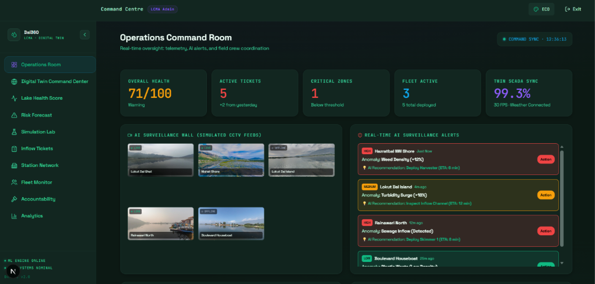
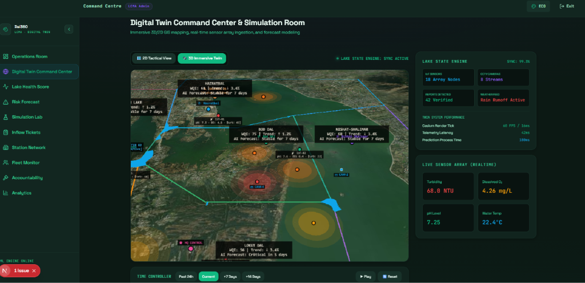
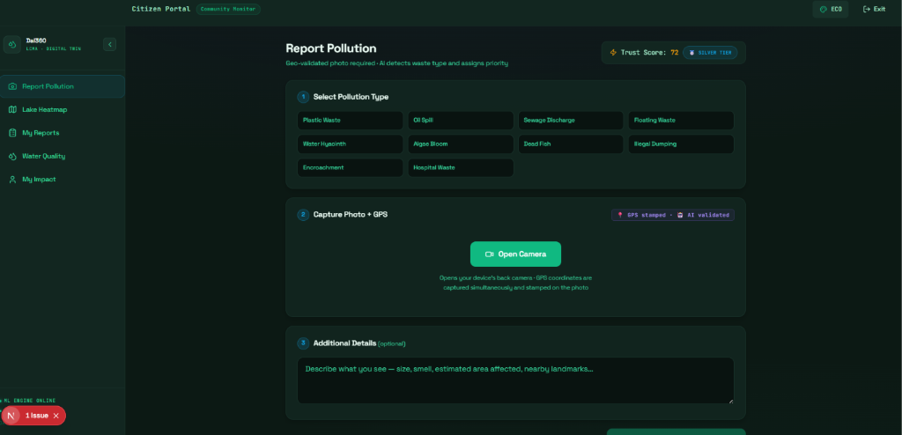
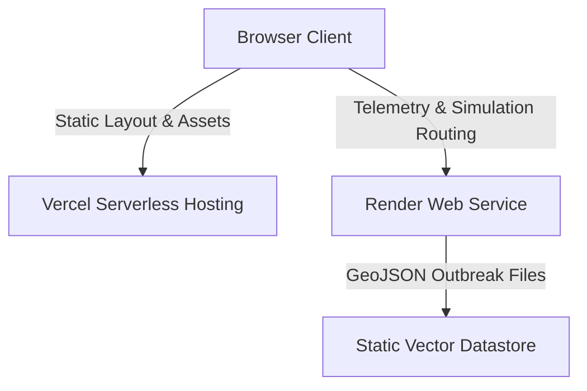

# 🌊 Dal360: Dynamic GIS Digital Twin Platform

Dal360 is an environmental intelligence system designed to preserve and manage Dal Lake in Srinagar, Kashmir. Using a dynamic GIS architecture, this platform enables automated pollution reporting, real-time dispatch operations, and environmental forecasting.

---

## 📸 Project Screenshots

### 1. Operations Room (Command Dashboard)


### 2. Immersive 3D Digital Twin (CesiumJS)


### 3. Citizen Pollution Reporting Portal


---

## 🛠️ Technology Stack & Architecture

* **Frontend**: Next.js 16.2 (React 19) + Tailwind CSS v4 + daisyUI v5
* **Mapping Engines**: Leaflet (Tactical 2D) & CesiumJS (Immersive 3D)
* **Backend API**: Python Flask + gunicorn (Production deployment)
* **GIS Datastore**: GeoJSON spatial vectors (`/public/geojson/`)



---

## ⚙️ Environment Variables

Prepare a `.env.local` inside the frontend directory `dal-lake-guardian/` with the following variables:

```ini
NEXT_PUBLIC_BACKEND_URL=https://your-backend-api.onrender.com
NEXT_PUBLIC_CESIUM_TOKEN=your_cesium_ion_token_here
```

---

## 🚀 Setup & Installation Instructions

### 1. Backend Engine Setup (Render)

1. Sign in to your [Render Dashboard](https://dashboard.render.com).
2. Create a **New Web Service** and link your repository.
3. Set the following settings:
   * **Root Directory**: `dal-lake-guardian/backend`
   * **Runtime**: `Python 3`
   * **Build Command**: `pip install -r requirements.txt`
   * **Start Command**: `gunicorn app:app`
4. Deploy the service. Copy the live URL generated by Render.

### 2. Frontend Dashboard Setup (Vercel)

1. Sign in to your [Vercel Dashboard](https://vercel.com).
2. Click **Add New** ➔ **Project** and import your repository.
3. Configure the build parameters:
   * **Root Directory**: `dal-lake-guardian`
   * **Framework Preset**: Select **Next.js** from the dropdown list.
4. Add the Environment Variables:
   * `NEXT_PUBLIC_BACKEND_URL` = (Your copied Render URL)
   * `NEXT_PUBLIC_CESIUM_TOKEN` = (Your Cesium Ion token)
5. Click **Deploy**.

---

## 💻 Local Development Commands

### Running the Python Backend
```bash
cd dal-lake-guardian/backend
pip install -r requirements.txt
python app.py
```
*App will start locally at `http://localhost:5000`.*

### Running the Next.js Frontend
```bash
cd dal-lake-guardian
npm install
npm run dev
```
*App will start locally at `http://localhost:3000`.*
